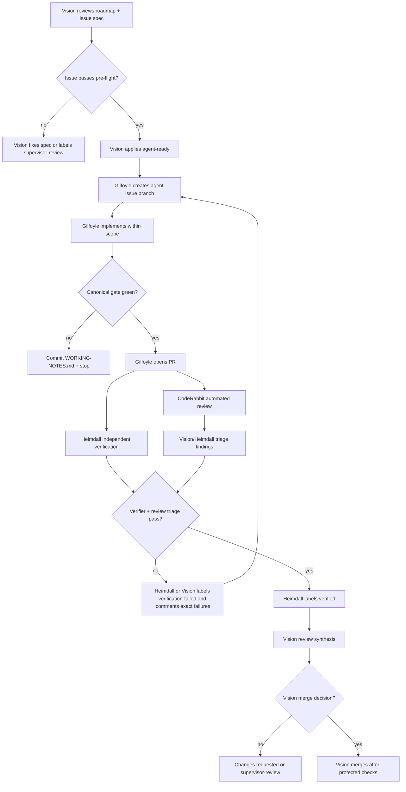
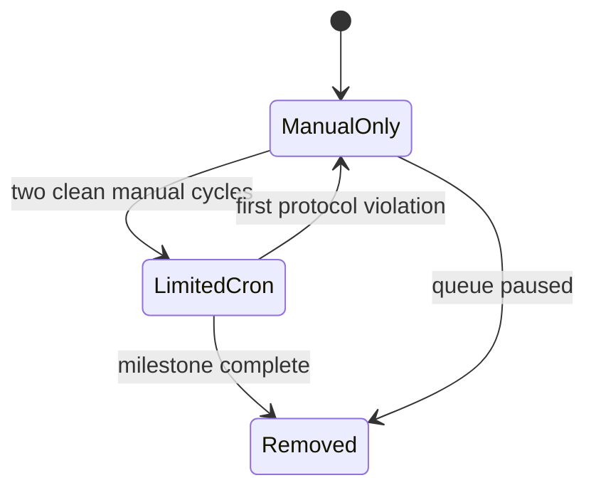

# OpenClaw Forge Protocol — python-docs-mcp-server

**Adopted:** 2026-05-29
**Status:** Active once merged with `AGENT-EXECUTION-PIPELINE.md`
**Scope:** OpenClaw orchestration for autonomous work on `ayhammouda/python-docs-mcp-server`

This document defines how OpenClaw agents execute the roadmap for this MCP server.
The repo has no product UI, so the old e-commerce forge shape does not apply:
there is no visual QA lane, no Vercel preview lane, and no design approval gate.

The core loop is:

- **Vision** plans, gates, reviews, and protects the repo.
- **Gilfoyle** implements one scoped issue at a time.
- **Heimdall** verifies behavior, packaging, security posture, and release readiness.
- **CodeRabbit** provides automated review signal that Heimdall and Vision must triage.
- **Vision** owns final autonomous merge decisions while Aymen is AFK; escalate only for money, secrets, external communication, or unresolved architecture calls.

`AGENT-EXECUTION-PIPELINE.md` remains the binding repo policy. This protocol is
the OpenClaw operating layer for applying that policy.

---

## 1. Role Map

| Role | Agent | Responsibility | May modify code? | May merge? |
|---|---|---|---|---|
| Supervisor | Vision (`main`) | Issue pre-flight, labels, branch protection, final review synthesis, stuck-work decisions | Yes, for protocol/config/documentation fixes | Yes, after verification and green checks |
| Implementer | Gilfoyle (`arch`) | Implement exactly one `agent-ready` issue, open/update one PR, run the canonical gate | Yes | No |
| Verifier | Heimdall (`test`) | Independently validate PR behavior, test evidence, packaging/install smoke, security/release risks | Only test artifacts or diagnostic notes when explicitly assigned | No |
| Automated reviewer | CodeRabbit | Static review comments, maintainability findings, and security-adjacent review signal | No | No |
| Designer | Saga (`design`) | Not in the default loop; no UI exists | No | No |
| Merger | Pipeline Monitor (`merge`) | Disabled for this repo unless Vision explicitly enables assisted merge checks | No | No |

No agent may claim to be Vision, Aymen, or a maintainer. Agent comments must use
their own role name and must not invoke supervisor override language.

---

## 2. Flow



The flow is deliberately slower than the Alto pipeline. This project is a public
developer tool with a small API surface; one bad unsupervised merge damages trust faster
than it saves time.

---

## 3. Labels

The repo should use these labels for the OpenClaw loop:

| Label | Set by | Meaning |
|---|---|---|
| `agent-ready` | Vision only | Issue passed pre-flight and may be picked up by Gilfoyle |
| `agent-in-progress` | Gilfoyle | Gilfoyle has claimed the issue |
| `agent-pr-opened` | Gilfoyle | Implementation PR exists |
| `verification-needed` | Gilfoyle | PR is ready for Heimdall |
| `verified` | Heimdall | Independent verification passed |
| `verification-failed` | Heimdall | Verification failed; comment contains exact reproduction |
| `supervisor-review` | Any agent | Vision decision required before further automation |

Only one of `verification-needed`, `verified`, and `verification-failed` should
be present on a PR at a time.

---

## 4. Vision Protocol

Vision owns the queue.

Before labeling an issue `agent-ready`, Vision must verify:

- The issue has every required section from `AGENT-EXECUTION-PIPELINE.md` §3.
- The issue links its `.planning/agent-context/<issue-slug>.md` file.
- The issue has clear in-scope and out-of-scope boundaries.
- The acceptance criteria are executable in under five minutes each.
- The canonical validation gate is green on current `main`.
- `main` branch protection keeps deletion and force-push protection active without review deadlock.
- The issue does not require spending money, external communication, secret
  rotation, architecture policy changes, or public API design judgment.

Vision also owns PR review synthesis:

- Check the PR diff against forbidden territory.
- Compare Heimdall's verification comment with Gilfoyle's claimed evidence.
- Read CodeRabbit findings and classify each as blocking, non-blocking follow-up,
  or false positive.
- Decide whether to request changes, label `supervisor-review`, request changes, or merge after green checks.

Vision may directly patch planning/protocol files when the gap is in the forge
itself, but feature implementation should normally go through Gilfoyle.

---

## 5. Gilfoyle Protocol

Gilfoyle owns implementation.

Per cycle, Gilfoyle must:

1. Pick exactly one open issue labeled `agent-ready` and not labeled
   `agent-in-progress`.
2. Add `agent-in-progress` to the issue.
3. Create branch `agent/<issue-number>-<slug>`.
4. Read only:
   - `AGENTS.md`
   - `AGENT-EXECUTION-PIPELINE.md`
   - this protocol
   - the linked per-issue context file
   - directly relevant source/tests
5. Implement only the scoped change.
6. Run the canonical gate:
   ```bash
   uv run ruff check src/ tests/
   uv run pyright src/
   uv run pytest --tb=short -q
   uv run python-docs-mcp-server doctor
   ```
7. Open a PR only if the gate is green.
8. Add `agent-pr-opened` and `verification-needed`.

Gilfoyle must stop and comment if:

- Any forbidden-territory path appears necessary.
- Tests fail for unclear reasons.
- The issue spec contradicts repo reality.
- The diff exceeds the issue's expected size by more than 2x.
- A runtime dependency or public tool contract change is needed.

Gilfoyle must not merge, approve, dismiss reviews, or add `verified`.

---

## 6. Heimdall Protocol

Heimdall owns verification, not UI testing.

For each PR labeled `verification-needed`, Heimdall must independently run:

```bash
uv run ruff check src/ tests/
uv run pyright src/
uv run pytest --tb=short -q
uv run python-docs-mcp-server doctor
```

Then add targeted checks based on touched files:

| Change type | Additional verification |
|---|---|
| MCP tool registration or protocol behavior | `uv run pytest tests/test_stdio_smoke.py -q` |
| Packaging / metadata / README / Glama | Build wheel/sdist locally and inspect package metadata |
| Cache/storage behavior | Run focused cache/storage tests and verify existing cache compatibility |
| Ingestion/version code | Run focused ingestion/version tests and, when feasible, `validate-corpus` |
| Security-sensitive parsing | Grep for unsafe APIs and confirm trust boundary documentation |
| ADR/docs-only PR | Verify links, file paths, command references, and forbidden-territory claims |

Heimdall must also read CodeRabbit's review before applying `verified`.
CodeRabbit is not authoritative, but unresolved blocking findings must prevent
`verified`.

Heimdall comments with:

- Commit SHA verified.
- Exact commands run.
- Pass/fail result.
- CodeRabbit triage summary: blocking / follow-up / false positive.
- Any risk not covered by tests.
- Final label action.

If verification passes, Heimdall replaces `verification-needed` with `verified`.
If it fails, Heimdall replaces `verification-needed` with `verification-failed`
and posts exact reproduction steps. Heimdall must not request merge.

---

## 7. CodeRabbit Protocol

CodeRabbit is part of review signal, not governance.

Required handling:

1. Wait for the CodeRabbit check or review comment when it appears on a PR.
2. Read every CodeRabbit finding that applies to the current PR head.
3. Classify each finding:
   - **Blocking:** correctness, security, public API drift, broken tests,
     packaging/release risk, forbidden-territory drift, or real maintainability
     issue inside the PR scope.
   - **Follow-up:** valid but outside the issue scope or not worth expanding
     the current PR.
   - **False positive:** inaccurate, contradicted by tests, or based on a
     misunderstanding of repo architecture.
4. Blocking findings must be fixed by Gilfoyle before `verified`.
5. Follow-up findings may become new issues if Vision agrees.
6. False positives should be acknowledged in Heimdall or Vision's review
   summary so Aymen does not have to re-triage them.

CodeRabbit cannot:

- Override the canonical validation gate.
- Approve a PR.
- Request merge.
- Bypass verification or green checks.
- Expand an issue's scope.

If CodeRabbit is unavailable or delayed, Vision may proceed after Heimdall
verification, but the PR summary must explicitly say CodeRabbit was unavailable
or still pending. Do not pretend a missing review is green.

---

## 8. Automation Mode

Initial v0.3.0 execution should be manual-triggered, not recurring cron.

Recommended launch sequence:

1. Merge the planning PR.
2. Confirm branch protection and labels.
3. Vision labels only one starter issue `agent-ready`.
4. Manually run Gilfoyle once.
5. Manually run Heimdall on the resulting PR.
6. Review the process, then decide whether to add short-lived crons.

Recurring crons are allowed only after two clean manual cycles. If enabled, use
short-lived project-specific jobs with explicit repo names and delete them after
the milestone. Do not reuse Alto cron prompts or webhook relay assumptions.



---

## 9. First Wave

Start with the lowest-risk issues after the planning PR lands:

1. README / PyPI / `glama.json` six-tool refresh.
2. PyYAML safe-loader audit.
3. ADR-006 serialization draft.
4. ADR-001 source adapters draft.

Delay zstd cache work until the dependency and dictionary/context API are
explicitly resolved by a maintainer-prep change. Delay CPython SHA pinning until
the SECURITY.md prose boundary is clear.

---

## 10. Stop Conditions

Pause the forge and remove `agent-ready` from the queue if any of these happen:

- A PR modifies forbidden territory without an explicit issue comment approving it.
- Gilfoyle works on more than one issue in a cycle.
- Heimdall verifies a different commit than the PR head.
- A PR is marked `verified` while a CodeRabbit blocking finding is unresolved.
- Any agent adds merge/approval language.
- Any job uses Alto/Shopify/Vercel-specific assumptions.
- The baseline canonical gate fails on `main`.

When paused, Vision writes a short incident note and fixes the protocol before
new work resumes. Small pauses are cheaper than turning a public repo into a
committee-authored incident report.
