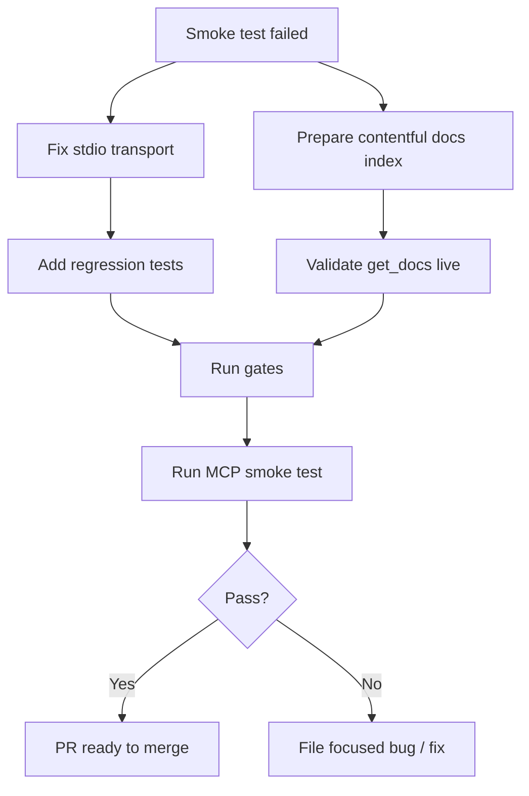

# PR #9 Smoke Failure Fix + Retest Plan

PR: https://github.com/ayhammouda/python-docs-mcp-server/pull/9  
Current branch: `fix/open-issues-cache-pypi-docs`  
Current head when this plan was written: `a54a2fe`

## Executive Summary

The PR implementation itself passed unit/service-level checks, but the MCP smoke test failed for two infrastructure reasons:

1. **MCP stdio transport bug** — protocol frames appear on `stderr` instead of `stdout`, so a real MCP client hangs.
2. **Local docs index is unusable for `get_docs` smoke testing** — installed index has version `3.13` but `0` documents, so full-page/section docs retrieval and real persistent cache writes cannot be validated.

This plan fixes those issues and then reruns the MCP smoke test properly.



## Issue 1 — MCP stdio responses emitted on `stderr`

### Symptom

Actual MCP stdio client invocation failed:

- JSON-RPC frames were emitted on `stderr`, not `stdout`.
- Client could not consume responses and hung.
- Existing service-level tests passed, so this is a transport/runtime bug.

### Likely Root Cause

`src/mcp_server_python_docs/__main__.py` intentionally redirects fd `1` to fd `2` early to protect the MCP protocol pipe from import-time stdout pollution:

```python
_saved_stdout_fd = os.dup(1)
os.dup2(2, 1)
sys.stdout = sys.stderr
```

Later, in `serve()`, it restores fd `1`:

```python
os.dup2(saved_stdout_fd, 1)
os.close(saved_stdout_fd)
mcp_server.run(transport="stdio")
```

But `sys.stdout` still references `sys.stderr`. If FastMCP writes through `sys.stdout` rather than raw fd `1`, frames still go to stderr.

### Fix Strategy

After restoring fd `1`, also restore the Python-level stdout object before calling FastMCP:

```python
os.dup2(saved_stdout_fd, 1)
os.close(saved_stdout_fd)
sys.stdout = sys.__stdout__
```

If `sys.__stdout__` does not behave reliably under tests, use an explicit fd wrapper:

```python
sys.stdout = os.fdopen(
    os.dup(1),
    "w",
    buffering=1,
    encoding=getattr(sys.__stdout__, "encoding", None) or "utf-8",
    errors="replace",
)
```

Prefer the smaller `sys.stdout = sys.__stdout__` first.

### Constraints

Keep non-serve commands safe:

- `doctor`
- `build-index`
- `--help`
- `--version`

These should still avoid stdout pollution unless deliberately allowed by existing tests.

### Regression Tests

Add or update tests around `tests/test_stdio_smoke.py` / `tests/test_stdio_hygiene.py`.

Required test behavior:

1. Start server as subprocess:

```bash
python -m mcp_server_python_docs serve
```

2. Send JSON-RPC initialize + tools/list frames through stdin.
3. Assert:
   - protocol responses are present on `stdout`;
   - `stderr` may contain logs but contains no JSON-RPC response frames;
   - stdout contains only valid JSON-RPC frames.

Suggested assertions:

```python
assert b'"jsonrpc"' in result.stdout
assert b'"tools/list"' not in result.stderr
assert b'"result"' not in result.stderr  # if robust enough
```

Better: parse both streams line-by-line and ensure all JSON-RPC response objects came from stdout only.

### Manual Validation

Run:

```bash
uv run pytest tests/test_stdio_smoke.py tests/test_stdio_hygiene.py -q
```

Then run the full gates:

```bash
uv run ruff check src/ tests/
uv run pyright src/
uv run pytest --tb=short -q
uv build
```

## Issue 2 — Local index has no documents

### Symptom

Gilfoyle reported:

```text
/home/ahammouda/.cache/mcp-python-docs/index.db has only 3.13 and 0 documents
```

Observed behavior:

- `get_docs(... version="3.12")` → version not found
- default `3.13` → page not found
- persistent cache DB exists but has `0` rows because `get_docs` never succeeds

### Root Cause

The currently installed index is likely symbol-only or incomplete. The smoke test requires contentful docs ingestion, not only `objects.inv` symbols.

Attempted full 3.12 build failed because system Python lacks `ensurepip` / `python3.12-venv`.

### Fix Strategy A — Preferred: Build a contentful index

1. Run doctor:

```bash
uv run python -m mcp_server_python_docs doctor
```

2. If it reports missing venv/ensurepip support, install the matching venv package.

On Ubuntu/Debian with Python 3.12:

```bash
sudo apt-get update
sudo apt-get install -y python3.12-venv
```

This requires elevated approval.

3. Build a minimal contentful index for smoke tests.

Prefer one version to keep runtime manageable:

```bash
uv run python -m mcp_server_python_docs build-index --versions 3.13
```

If the project specifically needs 3.12 too:

```bash
uv run python -m mcp_server_python_docs build-index --versions 3.12,3.13
```

4. Validate index content:

```bash
sqlite3 ~/.cache/mcp-python-docs/index.db \
  "SELECT ds.version, COUNT(d.id) AS documents, COUNT(s.id) AS sections
   FROM doc_sets ds
   LEFT JOIN documents d ON d.doc_set_id = ds.id
   LEFT JOIN sections s ON s.document_id = d.id
   GROUP BY ds.version;"
```

Expected:

- `documents > 0`
- `sections > 0`

5. Confirm a known page exists:

```bash
sqlite3 ~/.cache/mcp-python-docs/index.db \
  "SELECT slug, title FROM documents WHERE slug='library/json.html' LIMIT 1;"
```

Expected:

- one row for `library/json.html`

### Fix Strategy B — If full docs build is too slow/unavailable

Use a **temporary synthetic content index** for smoke tests only.

Do not replace the user’s real index permanently. Use an isolated `XDG_CACHE_HOME`:

```bash
export XDG_CACHE_HOME="$(mktemp -d)"
```

Create a minimal `index.db` with:

- one `doc_sets` row for `3.13`
- one `documents` row for `library/json.html`
- one or more `sections` rows, including a valid anchor like `top`
- rebuilt FTS tables if needed

Then run MCP server with that same `XDG_CACHE_HOME`.

This is acceptable for transport/cache smoke validation, but final release confidence should still include one real contentful index build when possible.

### Regression Test Recommendation

Add a new smoke fixture that creates a temporary contentful index and starts the server with isolated cache env.

Test should not depend on the machine’s global `~/.cache` state.

Suggested new test file:

```text
tests/test_mcp_get_docs_cache_smoke.py
```

Test behavior:

1. Create temp cache dir.
2. Create minimal valid index at `<temp-cache>/mcp-python-docs/index.db`.
3. Start server subprocess with `XDG_CACHE_HOME=<temp-cache>`.
4. Call `get_docs` through MCP stdio.
5. Assert returned content.
6. Stop server.
7. Inspect `retrieved-docs-cache.sqlite3` has one row.
8. Restart server.
9. Call same `get_docs`; assert same result.
10. Corrupt cache file; restart; assert `get_docs` still succeeds.

This makes future smoke tests deterministic and prevents the exact failure seen here: “global index exists but has no documents.”

## Issue 3 — Persistent cache live validation blocked

### Symptom

Cache service passed synthetic tests, but real cache creation/restart behavior could not be validated because `get_docs` failed before writing cache rows.

### Fix Strategy

After Issue 2 is fixed, run the cache smoke tests again.

Manual commands:

```bash
CACHE_DIR="$HOME/.cache/mcp-python-docs"
rm -f "$CACHE_DIR/retrieved-docs-cache.sqlite3"
```

Then call live MCP:

```text
get_docs(slug="library/json.html", version="3.13", max_chars=1000, start_index=0)
```

Inspect:

```bash
sqlite3 "$CACHE_DIR/retrieved-docs-cache.sqlite3" \
  "SELECT version, slug, anchor, max_chars, start_index, length(result_json)
   FROM retrieved_docs_cache;"
```

Expected:

- row exists for version `3.13`
- slug `library/json.html`
- anchor sentinel/internal representation is not user-visible, but row exists
- `result_json` length > 0

Restart server and repeat call.

Expected:

- same response
- if stats/logs expose cache hit, hit count increments

## Issue 4 — Test the actual MCP path, not just services

### Current State

The smoke run had many service-level passes. Those are useful but not enough because MCP transport failed.

### Required Post-Fix MCP Tests

Use an actual MCP client or subprocess JSON-RPC harness.

Minimum calls:

1. `tools/list`
2. `tools/call search_docs`
3. `tools/call get_docs` full page
4. `tools/call get_docs` valid section
5. `tools/call get_docs` empty anchor
6. `tools/call lookup_package_docs requests`
7. `tools/call lookup_package_docs missing package`

### Expected Results

| Test | Expected |
|---|---|
| tools/list | five tools, `lookup_package_docs` present |
| search_docs | returns hits from local index |
| get_docs full page | returns content and writes persistent cache row |
| get_docs section | returns section content |
| get_docs empty anchor | controlled not-found error, not cached full page |
| lookup_package_docs requests | PyPI-declared sources + trust boundary |
| missing package | `sources=[]`, controlled note |

## Proposed Work Breakdown for Gilfoyle

### Phase 1 — Fix stdio transport

- Patch `serve()` to restore `sys.stdout` after fd restoration.
- Add regression test proving JSON-RPC responses are on stdout, not stderr.
- Run stdio tests.

### Phase 2 — Make smoke index deterministic

Choose one:

- **Option A:** install `python3.12-venv` and build a real contentful index.
- **Option B:** add a temp synthetic-index smoke test harness using isolated `XDG_CACHE_HOME`.

Recommendation: do both if time allows. Option B should become the permanent CI regression test; Option A validates real user setup.

### Phase 3 — Rerun PR #9 MCP smoke plan

Use `PR9_MCP_TEST_PLAN.md` again after the fixes.

### Phase 4 — Report

Return a result summary:

```markdown
## PR #9 Transport/Index Fix Results

### Fixes Applied
- ...

### Gates
- ruff:
- pyright src:
- pytest:
- uv build:

### MCP Stdio
- initialize:
- tools/list:
- stdout/stderr framing:

### Index
- index build/fixture:
- versions:
- document count:
- section count:

### get_docs + Cache
- full page:
- section:
- empty anchor:
- cache file rows:
- restart cache reuse:
- corrupt cache fallback:

### lookup_package_docs
- requests:
- missing package:
- failure simulations:

### Verdict
PASS / FAIL

### Remaining Blockers
- ...
```

## Definition of Done

The issues are fixed when:

1. MCP JSON-RPC responses are emitted on stdout only.
2. stderr contains logs only, not protocol response frames.
3. Smoke tests use a contentful index, either real or deterministic synthetic fixture.
4. `get_docs` works through actual MCP, not just service calls.
5. Persistent cache file is created after real `get_docs` MCP call.
6. Cache survives server restart.
7. Corrupt cache does not break real MCP `get_docs`.
8. `lookup_package_docs` works through actual MCP.
9. Full validation passes:

```bash
uv run ruff check src/ tests/
uv run pyright src/
uv run pytest --tb=short -q
uv build
```

10. GitHub CI is green.

## Merge Guidance

Do **not** merge PR #9 until either:

- the stdio transport bug is fixed in this PR/branch and live MCP smoke tests pass; or
- the stdio transport bug is confirmed pre-existing, tracked separately, and Aymen explicitly accepts merging PR #9 with only service-level validation.

My recommendation: fix stdio now. An MCP server whose protocol writes to the wrong stream is a red-alert goblin, not a “later maybe.”
