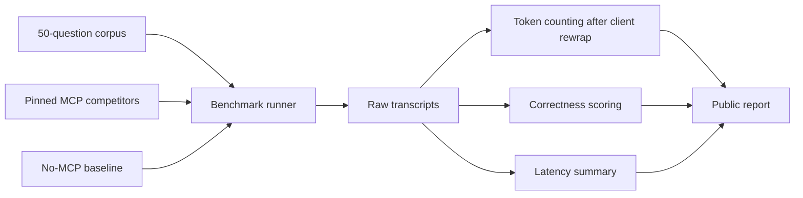

# Public Benchmark Methodology

**Status:** Accepted (blessed 2026-07-08; see PLAN-2026-07-08-benchmark-plumbing.md Amendment 1)
Do not publish comparative claims until the harness has produced reproducible
data from this methodology.

## Purpose

The v0.5.0 public benchmark compares `python-docs-mcp-server` with eligible
Python documentation MCPs and a no-MCP baseline on a fixed 50-question Python
documentation evaluation. The benchmark reports correctness, token cost, and
latency, with enough detail for a clean clone to reproduce the run.

This is an evidence artifact, not marketing copy. If the data is boring or
unfavorable, publish the data honestly and adjust the product claims.

## Evidence Flow

## Systems Under Test

The final competitor set is locked at execution time. A competitor is eligible
only if all of these are true:

- It exposes Python standard library documentation retrieval or search.
- It can be run or queried reproducibly from a clean clone.
- Its version, package, image, endpoint, or commit can be pinned.
- Its terms allow benchmark use.
- It does not require private, undocumented access.

The initial candidate matrix is:

- `python-docs-mcp-server`
- Context7
- GitMCP
- DeepWiki
- Ref.tools
- no-MCP baseline

The no-MCP baseline uses the same model and question prompts, but no retrieved
documentation context. It measures parametric model behavior, not another docs
tool.

## Corpus Design

The corpus contains exactly 50 questions. Each question must include:

- Stable question ID.
- Category.
- Python version or version pair.
- Prompt shown to the model.
- Official-docs answer key.
- Required citations or source sections.
- Expected answer properties.
- Known ambiguity notes, if any.

Distribution:

- 15 exact-symbol questions.
- 10 concept or API-usage questions.
- 15 cross-version questions, led by `compare_versions`-style diffs.
- 5 PEP-adjacent questions where the official stdlib docs or "What's New"
  pages contain the required answer.
- 5 applied questions that require selecting the right stdlib API from the
  documentation.

The corpus must avoid questions whose answer requires private knowledge,
external package documentation, non-stdlib behavior, or unreleased CPython
changes.

## Source Of Truth

Correctness is scored against official Python documentation generated from
CPython source at pinned tags. When a question concerns version behavior, the
answer key must cite the exact relevant version or version pair.

Allowed truth sources:

- CPython documentation source at pinned commit or tag.
- Generated official docs for the same Python version.
- Official "What's New" pages for PEP-adjacent behavior.

Disallowed truth sources:

- Blog posts.
- Search snippets.
- LLM-generated explanations.
- Third-party mirrors unless used only as a convenience link and verified
  against CPython source.

## Prompting Rules

Every system under test receives the same user question. The only allowed
difference is the documentation context supplied by that system.

The model prompt must require:

- A concise answer.
- Version-specific wording when the question names a version.
- No unsupported claims.
- A short citation to the retrieved section when the system provides one.

The prompt must not reveal the answer key, rubric, or expected winning system.

## Correctness Scoring

Each answer receives one score:

- `1.0`: Correct, version-aware, and includes all required answer properties.
- `0.5`: Partially correct, but misses a required nuance, version condition, or
  citation.
- `0.0`: Incorrect, unsupported, materially incomplete, or answers the wrong
  version.

For public reporting, include both:

- Mean correctness score.
- Per-category correctness score.

Any answer that appears correct but lacks evidence from the supplied docs is
marked in the raw results and discussed separately. The benchmark should reward
grounded answers, not confident autocomplete.

## Token Measurement

Token methodology follows roadmap decision 5.8 and ADR-006:

- Use Claude token counting as the primary metric.
- Measure after client-side rewrap, not only raw MCP payload bytes.
- Record raw payload tokens separately as diagnostic data.
- Report serialization latency alongside token counts.

Primary token count:

1. Capture the MCP tool response or baseline prompt context.
2. Pass it through the same client-side wrapping path used by the benchmark
   client.
3. Count the resulting message envelope with Claude token counting.

If a client cannot expose its exact wrapped message envelope, the report must
say so and mark that result as an approximation. Approximate counts must not be
used for headline claims.

## Latency Measurement

Latency is wall-clock time measured per question from request dispatch to final
answer receipt.

Report:

- Median.
- p95.
- Minimum and maximum.
- Cold-run and warm-run separation where the system has a cache or index.

Index build time is not part of per-query latency. It may be reported as setup
cost in a separate section.

## Reproducibility

The public harness must run from a clean clone with one command after dependency
installation. It must write:

- Competitor manifest with pinned versions.
- Corpus file.
- Raw transcripts.
- Raw scoring records.
- Token-count records.
- Latency records.
- Summary report.

Result files must include enough metadata to rerun or audit them:

- Repository commit.
- Python version.
- Operating system.
- Model name and provider.
- MCP client or adapter version.
- Competitor versions.
- Timestamp.

## Honesty Rules

- No comparative claim enters README, PyPI, launch copy, or social posts before
  public results exist.
- Do not drop failed systems silently. If a competitor cannot run, report the
  failure reason and exclude it from scored comparisons.
- Do not change the corpus after seeing results unless the change is documented
  and the whole benchmark is rerun.
- Do not tune prompts per competitor.
- Do not report approximate token counts as exact.

## Harness Work Packages

Once this methodology is accepted, the implementation can be split into smaller
agent-ready issues:

1. Corpus schema and fixture loader.
2. Baseline runner and transcript format.
3. `python-docs-mcp-server` runner.
4. Competitor manifest and adapter skeletons.
5. Correctness scorer with manual-adjudication hooks.
6. Claude token-count integration after client rewrap.
7. Latency recorder and report generator.

Each work package should reference this methodology and use `Refs #63`, not
`Closes #63`, until the full benchmark has produced public data.
